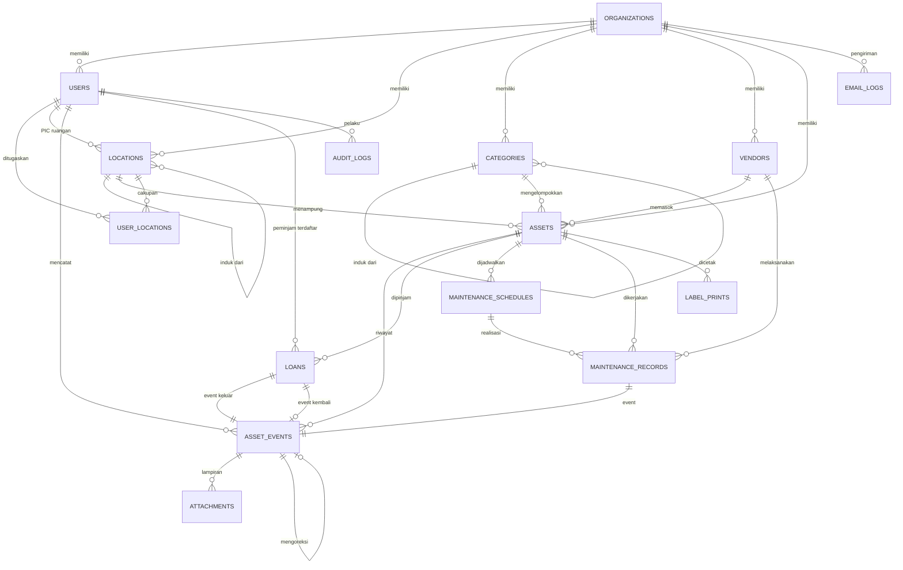
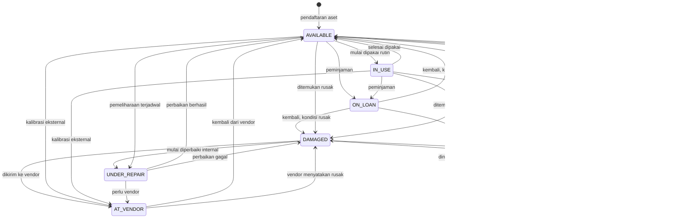

# 03 — ERD dan Skema Data

Basis data: **PostgreSQL 16**. Seluruh identitas primer memakai **UUID v7** (terurut waktu,
ramah indeks). Seluruh kolom waktu bertipe `timestamptz` dan disimpan dalam **UTC**.

---

## 1. Diagram Relasi



---

## 2. Enumerasi

```sql
-- Peran pengguna
CREATE TYPE user_role AS ENUM (
  'SUPERADMIN',   -- pengelola sistem, akses penuh termasuk konfigurasi
  'ADMIN',        -- pengelola aset lintas ruangan
  'PIC_ROOM',     -- penanggung jawab ruangan, terbatas pada cakupannya
  'TECHNICIAN',   -- teknisi, boleh mencatat perbaikan/kalibrasi lintas ruangan
  'VIEWER'        -- hanya baca
);

CREATE TYPE user_status AS ENUM ('INVITED', 'ACTIVE', 'DISABLED');

-- Tingkat lokasi
CREATE TYPE location_type AS ENUM ('BUILDING', 'FLOOR', 'DEPARTMENT', 'ROOM');

-- Status aset
CREATE TYPE asset_status AS ENUM (
  'AVAILABLE',     -- ada di tempat, siap dipakai
  'IN_USE',        -- terpasang/dipakai rutin di ruangannya
  'ON_LOAN',       -- sedang dipinjam, harus kembali
  'UNDER_REPAIR',  -- diperbaiki di dalam RS
  'AT_VENDOR',     -- keluar RS untuk servis/kalibrasi
  'DAMAGED',       -- rusak, belum ditangani
  'LOST',          -- dinyatakan hilang
  'DISPOSED'       -- dihapuskan dari daftar aset
);

-- Kondisi fisik
CREATE TYPE asset_condition AS ENUM ('GOOD', 'MINOR_ISSUE', 'NEEDS_REPAIR', 'UNUSABLE');

-- Jenis entri riwayat
CREATE TYPE event_type AS ENUM (
  'CREATED', 'INSPECTION', 'MAINTENANCE', 'REPAIR', 'CALIBRATION',
  'LOAN_OUT', 'LOAN_RETURN', 'TRANSFER', 'STATUS_CHANGE',
  'NOTE', 'DISPOSAL', 'CORRECTION', 'LABEL_PRINTED'
);

CREATE TYPE borrower_type AS ENUM ('INTERNAL_USER', 'EXTERNAL_PERSON');

CREATE TYPE maintenance_type AS ENUM ('CALIBRATION', 'PREVENTIVE', 'CORRECTIVE');

CREATE TYPE maintenance_result AS ENUM ('PASS', 'PASS_WITH_NOTE', 'FAIL');

CREATE TYPE funding_source AS ENUM ('APBD', 'APBN', 'BLUD', 'HIBAH', 'KSO', 'LAINNYA');

CREATE TYPE vendor_type AS ENUM ('SUPPLIER', 'SERVICE', 'CALIBRATION');

CREATE TYPE disposal_reason AS ENUM ('RUSAK_TOTAL', 'HILANG', 'DIHIBAHKAN', 'DIJUAL', 'KEDALUWARSA', 'LAINNYA');

CREATE TYPE print_reason AS ENUM ('FIRST_PRINT', 'LABEL_DAMAGED', 'LABEL_LOST', 'LABEL_FADED', 'RELOCATED');
```

---

## 3. Tabel

### 3.1 `organizations`

Akar multi-tenant. v1 hanya berisi satu baris, tetapi setiap query tetap memfilter dengannya.

| Kolom | Tipe | Keterangan |
|---|---|---|
| `id` | uuid PK | |
| `name` | text NOT NULL | Nama rumah sakit |
| `code` | text NOT NULL UNIQUE | Kode pendek untuk `asset_code`, mis. `RSXX` |
| `address` | text | |
| `logo_object_key` | text | Kunci objek di penyimpanan |
| `timezone` | text NOT NULL DEFAULT 'Asia/Jakarta' | |
| `loan_overdue_threshold_days` | int NOT NULL DEFAULT 7 | Ambang peringatan pinjam tanpa jatuh tempo |
| `created_at` / `updated_at` | timestamptz | |

### 3.2 `users`

| Kolom | Tipe | Keterangan |
|---|---|---|
| `id` | uuid PK | |
| `organization_id` | uuid FK → organizations | |
| `email` | citext NOT NULL | Unik per organisasi |
| `name` | text NOT NULL | |
| `phone` | text | |
| `password_hash` | text | NULL selama status `INVITED` |
| `role` | user_role NOT NULL | |
| `status` | user_status NOT NULL DEFAULT 'INVITED' | |
| `employee_number` | text | NIP/NIK pegawai |
| `job_title` | text | |
| `invite_token_hash` | text | |
| `invite_expires_at` | timestamptz | |
| `totp_secret` | text NULL | Terenkripsi. NULL berarti 2FA tidak aktif |
| `totp_enabled_at` | timestamptz NULL | |
| `recovery_codes` | text[] NULL | Di-hash satu per satu, dihapus dari larik setelah dipakai |
| `last_login_at` | timestamptz | |
| `created_at` / `updated_at` | timestamptz | |

```sql
CREATE UNIQUE INDEX users_org_email_uq ON users (organization_id, email);
```

**Aturan:** pengguna tidak pernah dihapus, hanya di-`DISABLED`, agar riwayat yang pernah
dicatatnya tetap memiliki pelaku yang valid.

### 3.3 `user_locations`

Pembatas cakupan untuk peran `PIC_ROOM`.

| Kolom | Tipe | Keterangan |
|---|---|---|
| `user_id` | uuid FK → users | |
| `location_id` | uuid FK → locations | Boleh menunjuk `DEPARTMENT`, cakupan menurun ke seluruh anaknya |

PK gabungan (`user_id`, `location_id`).

### 3.4 `locations`

Pohon lokasi yang mereferensi dirinya sendiri.

| Kolom | Tipe | Keterangan |
|---|---|---|
| `id` | uuid PK | |
| `organization_id` | uuid FK | |
| `parent_id` | uuid FK → locations NULL | NULL berarti `BUILDING` |
| `type` | location_type NOT NULL | |
| `name` | text NOT NULL | |
| `code` | text | Dipakai pada `asset_code`, biasanya pada tingkat `DEPARTMENT`, mis. `RAD` |
| `pic_user_id` | uuid FK → users NULL | Penanggung jawab ruangan |
| `path` | ltree atau text NOT NULL | Jalur terwujud untuk kueri subtree cepat |
| `is_active` | boolean NOT NULL DEFAULT true | |
| `created_at` / `updated_at` | timestamptz | |

```sql
CREATE INDEX locations_path_idx ON locations USING GIST (path);
CREATE INDEX locations_parent_idx ON locations (parent_id);
```

**Aturan:**
- `type` harus konsisten dengan induknya: `FLOOR` berinduk `BUILDING`, `DEPARTMENT` berinduk
  `FLOOR`, `ROOM` berinduk `DEPARTMENT`. Dijaga di lapisan aplikasi.
- Aset hanya boleh menunjuk lokasi bertipe `ROOM`.
- Lokasi yang memiliki aset atau anak tidak dapat dihapus, hanya `is_active = false`.
- `path` menyimpan jalur id leluhur sehingga filter "seluruh aset di Instalasi Radiologi"
  menjadi satu kueri tanpa rekursi.

### 3.5 `categories`

| Kolom | Tipe | Keterangan |
|---|---|---|
| `id` | uuid PK | |
| `organization_id` | uuid FK | |
| `parent_id` | uuid FK → categories NULL | Maksimal dua tingkat |
| `name` | text NOT NULL | |
| `code` | text | |
| `is_medical_device` | boolean NOT NULL DEFAULT false | Memicu kewajiban kalibrasi |
| `default_calibration_interval_months` | int NULL | Mengisi otomatis jadwal saat aset dibuat |
| `default_economic_life_years` | int NULL | |
| `is_active` | boolean NOT NULL DEFAULT true | |

### 3.6 `vendors`

| Kolom | Tipe | Keterangan |
|---|---|---|
| `id` | uuid PK | |
| `organization_id` | uuid FK | |
| `name` | text NOT NULL | |
| `type` | vendor_type[] NOT NULL | Satu vendor bisa pemasok sekaligus penyedia servis |
| `contact_person` / `phone` / `email` / `address` | text | |
| `is_active` | boolean NOT NULL DEFAULT true | |

### 3.7 `assets`

Tabel inti.

| Kolom | Tipe | Keterangan |
|---|---|---|
| `id` | uuid PK | Identitas internal |
| `organization_id` | uuid FK | |
| `public_id` | text NOT NULL UNIQUE | 12 karakter acak, isi QR. Tidak pernah berubah |
| `asset_code` | text NOT NULL | Kode terbaca manusia, unik per organisasi |
| `name` | text NOT NULL | |
| `category_id` | uuid FK → categories | |
| `location_id` | uuid FK → locations | Wajib bertipe `ROOM` |
| `status` | asset_status NOT NULL DEFAULT 'AVAILABLE' | |
| `condition` | asset_condition NOT NULL DEFAULT 'GOOD' | |
| `brand` | text | |
| `model` | text | |
| `serial_number` | text | |
| `year_manufactured` | int | |
| `acquisition_date` | date | |
| `acquisition_cost` | numeric(16,2) | |
| `funding_source` | funding_source NULL | |
| `acquisition_document_no` | text | Nomor SPK/BAST |
| `vendor_id` | uuid FK → vendors NULL | |
| `warranty_until` | date NULL | |
| `economic_life_years` | int NULL | |
| `responsible_user_id` | uuid FK → users NULL | PIC perorangan, dapat berbeda dari PIC ruangan |
| `primary_photo_key` | text NULL | Foto utama aset |
| `notes` | text | |
| `disposal_reason` | disposal_reason NULL | Terisi saat status `DISPOSED` |
| `disposed_at` | date NULL | Tanggal penghapusan menurut dokumen |
| `disposed_recorded_at` | timestamptz NULL | Waktu tombol hapuskan ditekan; dasar hitungan masa pembatalan |
| `disposal_revert_until` | timestamptz NULL | `disposed_recorded_at` + 30 hari. Lewat dari ini, pembatalan tidak mungkin |
| `status_before_disposal` | asset_status NULL | Status yang dipulihkan bila penghapusan dibatalkan |
| `qr_first_printed_at` | timestamptz NULL | |
| `created_by` | uuid FK → users | |
| `created_at` / `updated_at` | timestamptz | |

```sql
CREATE UNIQUE INDEX assets_public_id_uq ON assets (public_id);
CREATE UNIQUE INDEX assets_org_code_uq  ON assets (organization_id, asset_code);
CREATE INDEX assets_location_idx ON assets (organization_id, location_id);
CREATE INDEX assets_status_idx   ON assets (organization_id, status);
CREATE INDEX assets_category_idx ON assets (organization_id, category_id);
CREATE INDEX assets_serial_idx   ON assets (organization_id, serial_number)
  WHERE serial_number IS NOT NULL;

-- Daftar aset yang masih dalam masa pembatalan penghapusan
CREATE INDEX assets_revertible_idx ON assets (organization_id, disposal_revert_until)
  WHERE status = 'DISPOSED' AND disposal_revert_until IS NOT NULL;

-- Pencarian teks bebas
CREATE INDEX assets_search_idx ON assets USING GIN (
  to_tsvector('simple',
    coalesce(name,'') || ' ' || coalesce(asset_code,'') || ' ' ||
    coalesce(brand,'') || ' ' || coalesce(model,'') || ' ' || coalesce(serial_number,''))
);
```

**Aturan:**
- Aset tidak pernah dihapus secara fisik. Penghapusan berarti `status = 'DISPOSED'`.
- `status` tidak boleh diubah langsung lewat UPDATE tanpa menulis `asset_events`;
  dijaga oleh satu fungsi layanan tunggal di aplikasi.
- Penghapusan dapat dibatalkan selama `now() < disposal_revert_until`. Pembatalan
  mengembalikan `status` ke nilai `status_before_disposal`, mengosongkan keempat kolom
  penghapusan, dan menulis entri riwayat `CORRECTION`.
- Setelah `disposal_revert_until` terlewat, pembatalan ditolak. Baris tetap disimpan
  selamanya; tidak ada pekerjaan terjadwal yang menghapusnya.
- Seluruh daftar, pencarian, dan dashboard memfilter `status <> 'DISPOSED'` secara bawaan,
  sehingga dari sudut pandang pengguna aset tersebut memang hilang.
- Tidak ada relasi aset induk dan anak di v1. Bila kelak diperlukan, tambahkan satu kolom
  `parent_asset_id` yang nullable.

### 3.8 `asset_events`

Riwayat **append-only**. Tabel ini tidak menerima UPDATE maupun DELETE.

| Kolom | Tipe | Keterangan |
|---|---|---|
| `id` | uuid PK | |
| `organization_id` | uuid FK | |
| `asset_id` | uuid FK → assets | |
| `type` | event_type NOT NULL | |
| `title` | text NOT NULL | Ringkasan satu baris, tampil di linimasa publik |
| `notes` | text | Detail, tidak tampil di halaman publik |
| `occurred_at` | timestamptz NOT NULL | Waktu kejadian sebenarnya, boleh mundur |
| `recorded_at` | timestamptz NOT NULL DEFAULT now() | Waktu tersimpan, tidak dapat diisi klien |
| `recorded_by` | uuid FK → users NOT NULL | Pencatat |
| `location_id` | uuid FK → locations NULL | Lokasi aset saat kejadian (snapshot) |
| `status_before` | asset_status NULL | |
| `status_after` | asset_status NULL | |
| `corrects_event_id` | uuid FK → asset_events NULL | Diisi hanya pada tipe `CORRECTION` |
| `metadata` | jsonb NOT NULL DEFAULT '{}' | Muatan spesifik per tipe |

```sql
CREATE INDEX events_asset_time_idx ON asset_events (asset_id, occurred_at DESC);
CREATE INDEX events_org_type_idx   ON asset_events (organization_id, type, occurred_at DESC);
CREATE INDEX events_corrects_idx   ON asset_events (corrects_event_id)
  WHERE corrects_event_id IS NOT NULL;

-- Penegakan append-only di tingkat basis data
CREATE RULE asset_events_no_update AS ON UPDATE TO asset_events DO INSTEAD NOTHING;
CREATE RULE asset_events_no_delete AS ON DELETE TO asset_events DO INSTEAD NOTHING;
```

**Aturan:**
- `occurred_at` tidak boleh lebih besar dari `now()`.
- Peran aplikasi terhadap tabel ini hanya `INSERT` dan `SELECT`; hak `UPDATE`/`DELETE`
  dicabut di tingkat PostgreSQL.
- `CORRECTION` wajib mengisi `corrects_event_id` dan `notes` sebagai alasan.
- Contoh isi `metadata` per tipe:
  - `TRANSFER`: `{ "from_location_id": "...", "to_location_id": "...", "reason": "..." }`
  - `LOAN_OUT`: `{ "loan_id": "...", "borrower_name": "...", "due_at": "..." }`
  - `CALIBRATION`: `{ "record_id": "...", "result": "PASS", "valid_until": "2027-05-01" }`
  - `DISPOSAL`: `{ "reason": "RUSAK_TOTAL", "document_no": "..." }`
  - `LABEL_PRINTED`: `{ "print_id": "...", "reason": "LABEL_FADED" }`

### 3.9 `attachments`

| Kolom | Tipe | Keterangan |
|---|---|---|
| `id` | uuid PK | |
| `organization_id` | uuid FK | |
| `event_id` | uuid FK → asset_events | |
| `object_key` | text NOT NULL | Kunci di penyimpanan objek |
| `mime_type` | text NOT NULL | |
| `size_bytes` | bigint NOT NULL | |
| `width` / `height` | int NULL | Untuk gambar |
| `original_filename` | text | |
| `uploaded_by` | uuid FK → users | |
| `created_at` | timestamptz | |

```sql
CREATE INDEX attachments_event_idx ON attachments (event_id);
```

**Aturan:** maksimal 5 baris per `event_id`, dijaga di aplikasi. Lampiran mengikuti sifat
append-only entri induknya: tidak dihapus setelah entri tersimpan.

Pola penamaan kunci objek:
`{organization_id}/assets/{asset_id}/events/{event_id}/{uuid}.{ext}`

### 3.10 `loans`

| Kolom | Tipe | Keterangan |
|---|---|---|
| `id` | uuid PK | |
| `organization_id` | uuid FK | |
| `asset_id` | uuid FK → assets | |
| `borrower_type` | borrower_type NOT NULL | |
| `borrower_user_id` | uuid FK → users NULL | Diisi bila `INTERNAL_USER` |
| `borrower_name` | text NULL | Wajib bila `EXTERNAL_PERSON` |
| `borrower_phone` | text NULL | Wajib bila `EXTERNAL_PERSON` |
| `borrower_unit` | text NULL | Opsional |
| `purpose` | text NOT NULL | Keperluan peminjaman |
| `borrowed_at` | timestamptz NOT NULL | |
| `due_at` | timestamptz NULL | Opsional |
| `returned_at` | timestamptz NULL | NULL berarti masih dipinjam |
| `condition_out` | asset_condition NOT NULL | |
| `condition_in` | asset_condition NULL | |
| `return_notes` | text | |
| `checkout_event_id` | uuid FK → asset_events NOT NULL | |
| `checkin_event_id` | uuid FK → asset_events NULL | |
| `recorded_by` | uuid FK → users NOT NULL | Petugas yang mencatat, bukan peminjam |
| `returned_recorded_by` | uuid FK → users NULL | |
| `created_at` | timestamptz | |

```sql
-- Satu aset hanya boleh punya satu peminjaman aktif
CREATE UNIQUE INDEX loans_one_active_per_asset
  ON loans (asset_id) WHERE returned_at IS NULL;

CREATE INDEX loans_active_idx ON loans (organization_id, borrowed_at DESC)
  WHERE returned_at IS NULL;
```

**Aturan:**
- `CHECK`: bila `borrower_type = 'EXTERNAL_PERSON'` maka `borrower_name` dan `borrower_phone`
  tidak boleh NULL; bila `INTERNAL_USER` maka `borrower_user_id` tidak boleh NULL.
- `CHECK`: `returned_at >= borrowed_at`.
- Indeks parsial unik di atas adalah penjaga sesungguhnya terhadap peminjaman ganda —
  jangan hanya mengandalkan pengecekan di aplikasi.

### 3.11 `maintenance_schedules`

| Kolom | Tipe | Keterangan |
|---|---|---|
| `id` | uuid PK | |
| `organization_id` | uuid FK | |
| `asset_id` | uuid FK → assets | |
| `type` | maintenance_type NOT NULL | `CALIBRATION` atau `PREVENTIVE` |
| `interval_months` | int NOT NULL | |
| `last_performed_at` | date NULL | |
| `next_due_at` | date NOT NULL | Dihitung otomatis, dapat ditimpa manual |
| `is_active` | boolean NOT NULL DEFAULT true | |
| `notes` | text | |

```sql
CREATE INDEX schedules_due_idx ON maintenance_schedules (organization_id, next_due_at)
  WHERE is_active = true;
```

### 3.12 `maintenance_records`

Realisasi pelaksanaan pemeliharaan, perbaikan, atau kalibrasi.

| Kolom | Tipe | Keterangan |
|---|---|---|
| `id` | uuid PK | |
| `organization_id` | uuid FK | |
| `asset_id` | uuid FK → assets | |
| `schedule_id` | uuid FK → maintenance_schedules NULL | NULL untuk perbaikan insidental |
| `type` | maintenance_type NOT NULL | |
| `performed_at` | date NOT NULL | |
| `performed_by_vendor_id` | uuid FK → vendors NULL | |
| `performed_by_internal` | text NULL | Nama teknisi internal |
| `result` | maintenance_result NULL | Wajib untuk `CALIBRATION` |
| `valid_until` | date NULL | Masa berlaku sertifikat |
| `certificate_number` | text NULL | |
| `certificate_object_key` | text NULL | Berkas sertifikat |
| `cost` | numeric(16,2) NULL | |
| `parts_replaced` | text NULL | |
| `description` | text | |
| `event_id` | uuid FK → asset_events NOT NULL | |
| `created_by` | uuid FK → users | |
| `created_at` | timestamptz | |

**Aturan:** menyimpan record dengan `schedule_id` terisi akan memperbarui
`last_performed_at` dan menghitung ulang `next_due_at` pada jadwalnya.
Bila `valid_until` diisi, nilai itu yang dipakai sebagai `next_due_at`.
`result = 'FAIL'` mengubah status aset menjadi `DAMAGED`.

### 3.13 `label_prints`

| Kolom | Tipe | Keterangan |
|---|---|---|
| `id` | uuid PK | |
| `organization_id` | uuid FK | |
| `asset_id` | uuid FK → assets | |
| `reason` | print_reason NOT NULL | |
| `label_size` | text NOT NULL | mis. `50x30mm`, `A4_SHEET` |
| `printed_by` | uuid FK → users | |
| `printed_at` | timestamptz NOT NULL DEFAULT now() | |

### 3.14 `audit_logs`

Untuk aksi yang bukan riwayat aset: login, manajemen pengguna, perubahan master data,
perubahan konfigurasi.

| Kolom | Tipe | Keterangan |
|---|---|---|
| `id` | uuid PK | |
| `organization_id` | uuid FK NULL | NULL untuk aksi tingkat sistem |
| `actor_user_id` | uuid FK → users NULL | NULL untuk aksi anonim |
| `action` | text NOT NULL | mis. `user.invite`, `location.update`, `auth.login_failed` |
| `entity_type` | text | |
| `entity_id` | uuid NULL | |
| `changes` | jsonb | Sebelum/sesudah |
| `ip_address` | inet NULL | |
| `user_agent` | text NULL | |
| `created_at` | timestamptz NOT NULL DEFAULT now() | |

### 3.15 `email_logs`

| Kolom | Tipe | Keterangan |
|---|---|---|
| `id` | uuid PK | |
| `organization_id` | uuid FK | |
| `to_email` | text NOT NULL | |
| `template` | text NOT NULL | `daily_digest`, `user_invite`, `password_reset` |
| `subject` | text | |
| `status` | text NOT NULL | `SENT`, `FAILED` |
| `error` | text NULL | |
| `sent_at` | timestamptz NOT NULL DEFAULT now() | |

### 3.16 Tabel sesi

Mengikuti skema bawaan Auth.js: `sessions`, `verification_tokens`. Tidak ada tabel
`accounts` karena v1 hanya memakai kredensial email dan kata sandi.

Kolom tambahan pada `sessions`:

| Kolom | Tipe | Keterangan |
|---|---|---|
| `remembered` | boolean NOT NULL DEFAULT false | true bila pengguna memilih "Ingat saya" |
| `expires_at` | timestamptz NOT NULL | 12 jam, atau 7 hari bila `remembered` |
| `ip_address` / `user_agent` | inet / text | Untuk daftar perangkat aktif di halaman profil |

---

## 4. State Machine Status Aset



**Aturan penegakan:**

| Aturan | Alasan |
|---|---|
| Transisi yang tidak tergambar ditolak | Mencegah status tidak masuk akal, mis. `DISPOSED` → `ON_LOAN` |
| `ON_LOAN` hanya dapat dimasuki lewat pembuatan peminjaman | Status dan tabel peminjaman tidak boleh berbeda cerita |
| `ON_LOAN` hanya dapat ditinggalkan lewat pengembalian atau pernyataan hilang | Sama seperti di atas |
| `DISPOSED` dapat dibatalkan selama 30 hari, sesudahnya final | Memaafkan salah klik tanpa membuat penghapusan terasa main-main. Pemulihan mengembalikan status ke nilai sebelum dihapuskan, bukan selalu ke `AVAILABLE` |
| Aset `ON_LOAN` tidak dapat dimutasi | Lokasi fisik tidak diketahui selama dipinjam |
| Setiap transisi menulis satu `asset_events` | Tidak ada perubahan status tanpa jejak |

---

## 5. Aturan Integritas Lintas Tabel

1. **Isolasi organisasi.** Setiap kueri dari aplikasi wajib menyertakan `organization_id`.
   Disarankan mengaktifkan Row Level Security pada tabel utama sebagai jaring pengaman,
   dengan `current_setting('app.current_org')` ditetapkan per transaksi.
2. **Aset hanya pada ruangan.** Ditegakkan lewat pemeriksaan aplikasi ditambah trigger
   yang memastikan `locations.type = 'ROOM'`.
3. **Konsistensi peminjaman.** `assets.status = 'ON_LOAN'` bila dan hanya bila terdapat
   baris `loans` dengan `returned_at IS NULL`. Disediakan kueri pemeriksa konsistensi
   yang dijalankan harian bersama tugas terjadwal.
4. **Tidak ada penghapusan keras** pada `assets`, `asset_events`, `loans`,
   `maintenance_records`, `users`. Seluruh FK memakai `ON DELETE RESTRICT`.
5. **Waktu.** `occurred_at <= now()`, `recorded_at` selalu berasal dari server.

---

## 6. Data Awal (Seed)

Perlu disiapkan sebagai bagian instalasi:

- Satu organisasi dengan kode RS.
- Satu pengguna `SUPERADMIN`.
- Kategori dasar: Elektromedik (medis, interval kalibrasi 12 bulan), Alat Penunjang Medis
  (medis, 12 bulan), Furnitur, Perangkat IT, Alat Rumah Tangga, Kendaraan.
- Struktur lokasi contoh satu gedung, satu lantai, satu instalasi, beberapa ruangan.

---

## 7. Ruang untuk v2

Skema sudah menyiapkan tempat untuk pengembangan berikut tanpa migrasi besar:

| Rencana v2 | Cara masuk ke skema saat ini |
|---|---|
| Stok barang habis pakai | Tabel baru `stock_items` dan `stock_movements`, terpisah dari `assets` |
| Multi rumah sakit | Sudah ada `organization_id` di semua tabel; tinggal buka UI dan pemilih organisasi |
| Work order penuh | Tabel `work_orders` yang menunjuk `maintenance_records` |
| Mode offline | Menambahkan `client_generated_id` unik pada `asset_events` untuk idempotensi sinkronisasi |
| Tanda tangan digital | Kolom `signature_object_key` pada `loans` |
| Integrasi SIMRS | Kolom `external_ref` bertipe jsonb pada `assets` |
| Aset induk dan anak | Kolom `parent_asset_id` nullable pada `assets`, ditambahkan saat dibutuhkan |
| Anonimisasi data peminjam | Kolom `anonymized_at` pada `loans`; nama dan nomor HP diganti, barisnya tetap |
