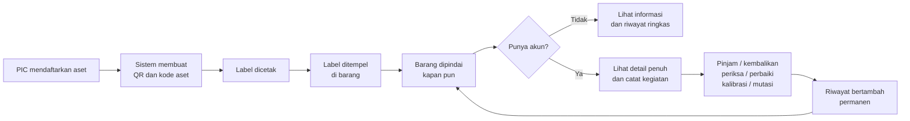
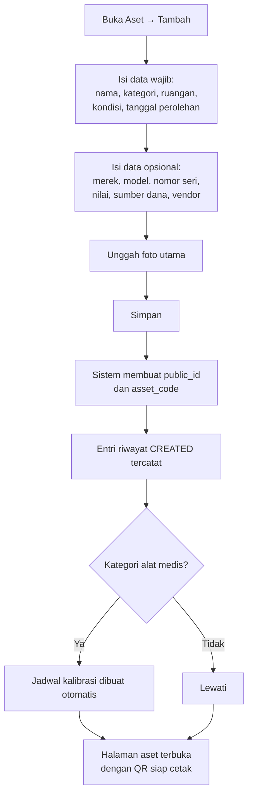
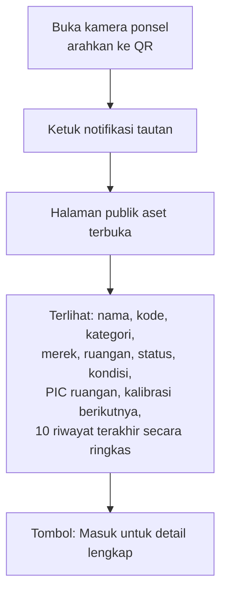
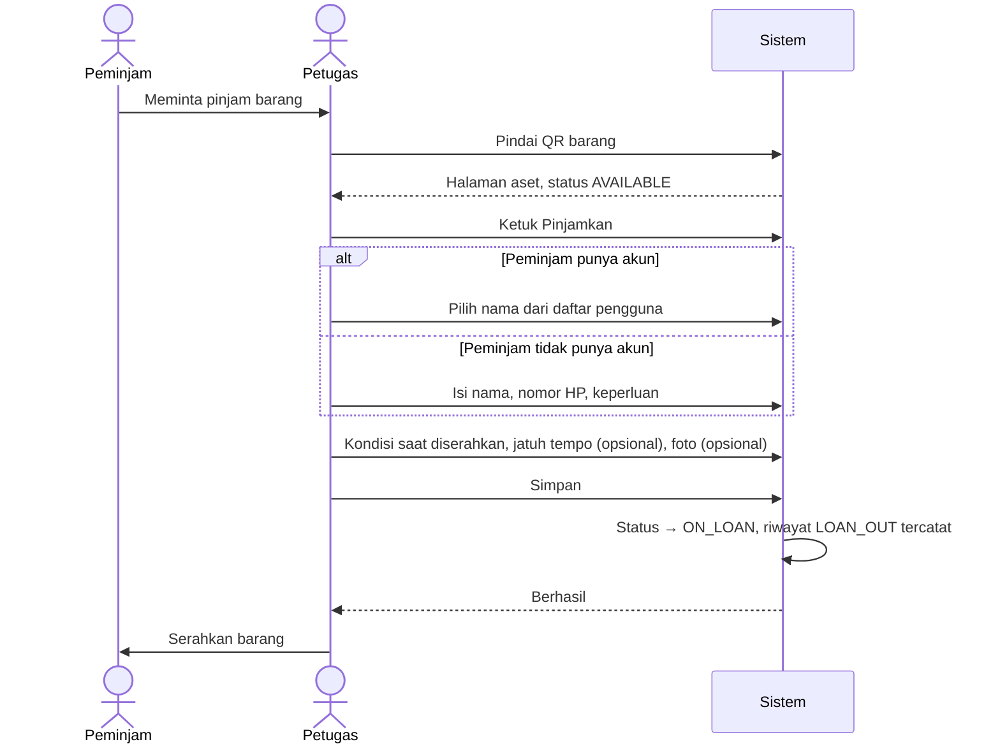
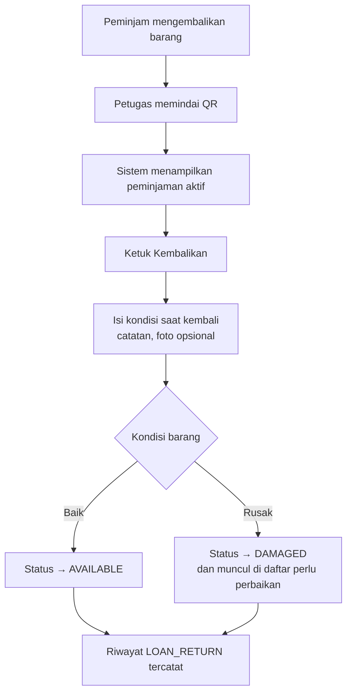
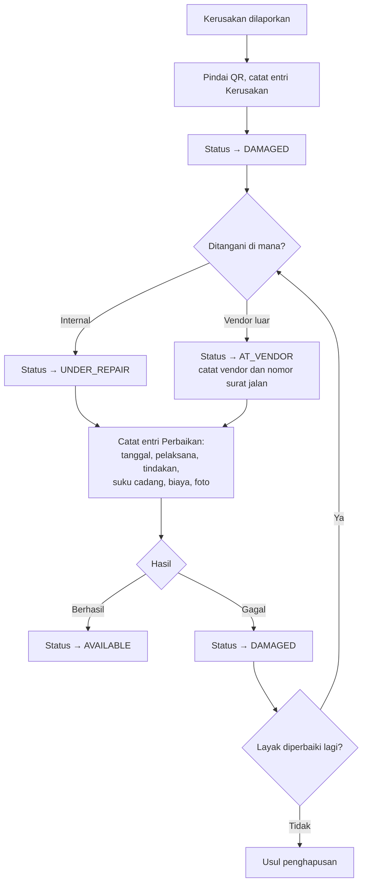
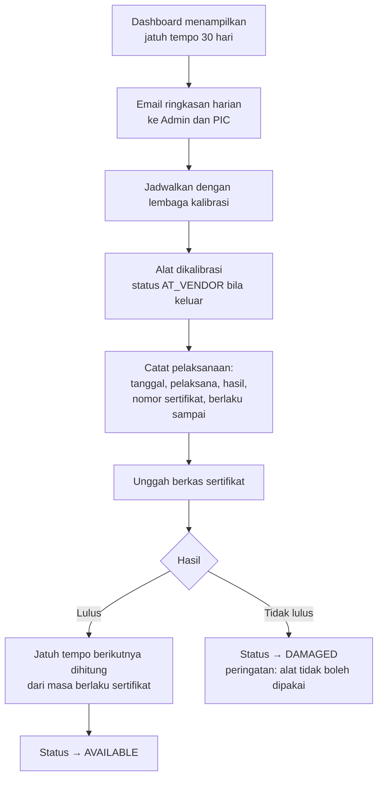

# 05 — Alur Penggunaan

Dokumen ini menggambarkan bagaimana sistem dipakai sehari-hari, bukan bagaimana ia dibangun.

---

## 1. Peta Besar

---

## 2. Onboarding Awal (satu kali)

Dilakukan sebelum sistem dipakai harian. Inilah tahap yang paling menentukan apakah sistem
akan dipakai atau ditinggalkan.

1. **Super Admin** menyiapkan organisasi: nama RS, kode RS, logo.
2. Menyusun struktur lokasi: gedung, lantai, instalasi, ruangan, lengkap dengan kode instalasi.
3. Menyusun kategori dan menandai mana yang alat medis beserta interval kalibrasinya.
4. Mengundang pengguna dan menetapkan peran. PIC Ruangan dikaitkan dengan ruangannya.
5. **Pendataan per ruangan, bukan serentak.** Ambil satu instalasi sebagai percontohan.
   Data dapat diinput satu per satu atau diimpor massal dari Excel.
6. Cetak seluruh label instalasi tersebut sekaligus, tempel dalam satu sesi.
7. Jalankan satu bulan penuh di instalasi itu sebelum melebar ke instalasi berikutnya.

> Kesalahan yang paling sering terjadi adalah mencoba mendata seluruh rumah sakit sekaligus.
> Pendataan menjadi pekerjaan berbulan-bulan, tidak ada yang memakai sistemnya, dan data
> pertama sudah basi sebelum data terakhir masuk.

---

## 3. Mendaftarkan Aset Baru

**Pelaku:** PIC Ruangan atau Admin

**Yang perlu diperhatikan:**
- Nomor seri yang sudah pernah dipakai akan memunculkan peringatan. Ini biasanya berarti
  barang yang sama didata dua kali.
- Kalau barang datang dalam jumlah banyak dan identik, gunakan impor massal, bukan mengisi
  formulir berulang kali.

---

## 4. Mencetak dan Menempel Label

**Pelaku:** PIC Ruangan atau Admin

1. Dari halaman aset, pilih **Cetak Label**; atau dari daftar aset, centang banyak aset lalu
   pilih **Cetak Lembar A4**.
2. Pilih ukuran label sesuai printer yang tersedia.
3. Periksa pratinjau, lalu cetak.
4. Tempel pada permukaan yang **datar, bersih, dan tidak sering disentuh atau diseka**.
   Hindari menempel di dekat engsel, roda, permukaan panas, atau bagian yang dibongkar saat servis.
5. Pindai sendiri label yang baru ditempel untuk memastikan terbaca. Ini langkah yang paling
   sering dilewatkan dan paling sering disesali.

**Bila label rusak atau hilang:** buka aset lewat pencarian kode, pilih Cetak Ulang, isi
alasannya. QR yang baru mengarah ke aset yang sama — identitas aset tidak pernah berubah.

---

## 5. Memindai QR

### 5.1 Oleh orang tanpa akun

Tidak perlu memasang aplikasi apa pun. Kamera bawaan ponsel sudah cukup.

### 5.2 Oleh petugas yang sudah login

Dari dalam aplikasi, tombol **Pindai** membuka kamera dan langsung menuju halaman aset
dengan seluruh tombol tindakan tersedia. Bila label rusak sehingga tidak terbaca, tersedia
isian kode aset manual.

---

## 6. Peminjaman

**Pelaku:** PIC Ruangan, Admin, atau Teknisi — bukan peminjamnya sendiri.

**Aturan yang berlaku:**
- Tidak ada persetujuan. Peminjaman langsung berlaku begitu disimpan.
- Barang yang sedang dipinjam tidak bisa dipinjamkan lagi. Sistem menolak dan menunjukkan
  siapa yang sedang memegangnya.
- Jatuh tempo boleh dikosongkan, tetapi peminjaman tanpa jatuh tempo yang berjalan lebih
  dari tujuh hari akan muncul di dashboard sebagai perlu ditinjau.
- Yang bertanggung jawab atas pencatatan adalah petugas yang login, bukan peminjam.

### Pengembalian

---

## 7. Pengecekan Rutin

**Pelaku:** PIC Ruangan

Ronde berkala memeriksa barang di ruangannya:

1. Buka daftar aset ruangan, atau langsung pindai satu per satu.
2. Untuk tiap barang, catat entri **Pengecekan** berisi kondisi saat diperiksa, catatan,
   dan foto bila ada temuan.
3. Bila barang tidak ditemukan, ubah statusnya menjadi `LOST` disertai catatan. Status ini
   dapat dikembalikan bila barang ditemukan lagi — dan perjalanan itu tetap terekam.

---

## 8. Perbaikan

**Pelaku:** Teknisi atau Admin

Barang yang keluar rumah sakit untuk diservis **harus** diberi status `AT_VENDOR`, bukan
dibiarkan `AVAILABLE`. Inilah titik di mana barang paling sering hilang tanpa jejak.

---

## 9. Kalibrasi Alat Medis

**Pelaku:** Teknisi elektromedik atau Admin

Sertifikat yang terunggah menjadi bukti saat akreditasi. Inilah alasan berkas sertifikat
disimpan di sistem, bukan hanya nomornya.

---

## 10. Mutasi Ruangan

**Pelaku:** Admin, atau PIC asal dengan sepengetahuan PIC tujuan

1. Buka aset, pilih **Mutasi**.
2. Pilih ruangan tujuan, isi alasan dan tanggal kejadian.
3. PIC aset otomatis mengikuti PIC ruangan tujuan, dan dapat diubah manual.
4. Bila aset memiliki aset anak, sistem menawarkan memindahkan seluruhnya.
5. Entri riwayat `TRANSFER` tercatat lengkap dengan ruangan asal dan tujuan.

Mutasi berbeda dari peminjaman: mutasi bersifat permanen dan mengubah siapa yang bertanggung
jawab, peminjaman bersifat sementara dan menuntut pengembalian. Barang yang sedang dipinjam
tidak dapat dimutasi sebelum dikembalikan.

---

## 11. Mengoreksi Kesalahan Pencatatan

Riwayat tidak dapat diubah maupun dihapus. Bila terjadi salah catat:

1. Buka entri yang keliru pada linimasa.
2. Pilih **Koreksi**.
3. Tuliskan apa yang sebenarnya terjadi dan mengapa entri sebelumnya keliru.
4. Kedua entri tetap tampil. Entri lama diberi tanda telah dikoreksi dan tertaut ke koreksinya.

Ini terasa lebih merepotkan daripada tombol hapus, dan memang disengaja. Riwayat yang bisa
dihapus tidak bernilai sebagai bukti.

---

## 12. Penghapusan Aset

**Pelaku:** Admin atau Super Admin

1. Buka aset, pilih **Hapuskan Aset**.
2. Pilih alasan: rusak total, hilang, dihibahkan, dijual, atau kedaluwarsa.
3. Isi tanggal dan nomor dokumen penghapusan bila ada.
4. Status menjadi `DISPOSED`, aset keluar dari daftar aktif.
5. Halaman publiknya tetap dapat dibuka dan menampilkan penanda bahwa aset telah dihapuskan,
   sehingga label yang masih menempel tetap memberi jawaban yang benar.

---

## 13. Kegiatan Harian per Peran

| Peran | Yang dilakukan setiap hari |
|---|---|
| **PIC Ruangan** | Mencatat peminjaman dan pengembalian di ruangannya, menanggapi jatuh tempo yang muncul di dashboard, mencatat temuan pengecekan |
| **Teknisi** | Membuka daftar aset rusak, mencatat perbaikan dan kalibrasi beserta bukti foto |
| **Admin** | Meninjau peminjaman yang telat, memantau kepatuhan kalibrasi, mendaftarkan aset baru dari pengadaan, mengekspor laporan |
| **Super Admin** | Mengelola pengguna dan master data, memantau cadangan dan kesehatan sistem |
| **Manajemen** | Membuka dashboard dan laporan, tanpa perlu mengubah apa pun |
