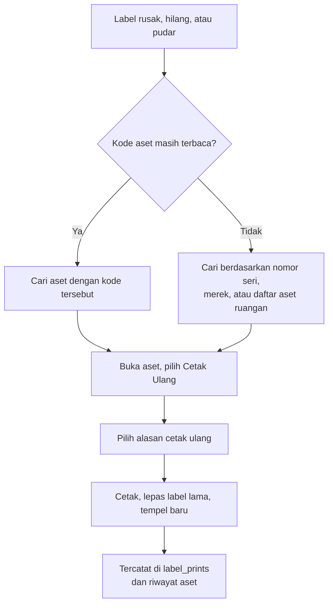

# 08 — QR Code dan Pelabelan

Label fisik adalah satu-satunya bagian sistem ini yang hidup di dunia nyata, terkena
desinfektan, tergores troli, dan terkelupas. Bagian ini paling sering diremehkan dan paling
mahal untuk diperbaiki belakangan — memperbaikinya berarti mengunjungi kembali setiap barang.

---

## 1. Isi QR Code

QR memuat **satu URL absolut** dan tidak lebih:

```
https://{DOMAIN}/a/x7Kp92mQr4Lt
```

Satu domain dipakai bersama seluruh pelanggan. `public_id` unik secara global sehingga tidak
ada tabrakan antar rumah sakit, dan label tidak terikat pada nama rumah sakit mana pun —
penting karena nama dan struktur organisasi bisa berubah, sedangkan label sudah menempel.

> **Selama pengembangan, `APP_URL` bernilai `http://localhost:3000`.** QR yang dihasilkan
> hanya berlaku di mesin sendiri. Jangan mencetak label sungguhan sebelum domain produksi
> ditetapkan — ini satu-satunya kesalahan dalam proyek ini yang biaya perbaikannya bersifat
> fisik dan berlipat sesuai jumlah aset.

**Mengapa URL, bukan data aset.** Data aset berubah — ruangan pindah, PIC berganti, status
bergerak. Kalau data ada di dalam QR, setiap perubahan menuntut cetak ulang. URL bersifat
permanen dan selalu menunjukkan keadaan terbaru.

**Mengapa bukan JSON atau teks kode saja.** Kamera bawaan ponsel mengenali URL dan langsung
menawarkan membukanya. Teks biasa hanya ditampilkan apa adanya, sehingga menuntut aplikasi
pemindai khusus — dan menuntut aplikasi khusus berarti tidak ada yang memakainya.

### Format `public_id`

- Panjang 12 karakter
- Alfabet 57 karakter, tanpa `0`, `O`, `1`, `l`, `I` yang mudah tertukar saat dibaca manusia
- Dibangkitkan dengan generator acak kriptografis, bukan pseudo-acak biasa
- Ruang sekitar 5 × 10²¹ kombinasi, sehingga penebakan tidak praktis
- Pemeriksaan tabrakan saat pembuatan; ulangi bila bertabrakan
- **Tidak pernah berubah sepanjang umur aset**, termasuk ketika label dicetak ulang

### Format `asset_code`

```
{KODE_RS}-{KODE_INSTALASI}-{TAHUN}-{URUTAN}
RSXX-RAD-2026-0012
```

Kode ini untuk manusia: dibacakan lewat telepon, ditulis di berita acara, diketikkan saat
label rusak. Kode ini bersifat deskriptif, bukan jalan masuk — mengetahuinya tidak membuka
halaman mana pun tanpa login.

Urutan dihitung per instalasi per tahun. Bila aset dimutasi ke instalasi lain,
`asset_code` **tidak berubah**; mengubahnya akan memutus rujukan pada dokumen lama.

---

## 2. Spesifikasi QR

| Parameter | Nilai | Alasan |
|---|---|---|
| Versi | Otomatis, biasanya 3–4 | Mengikuti panjang URL |
| Tingkat koreksi kesalahan | **M** (15%) | Menyeimbangkan ketahanan terhadap goresan dengan kepadatan modul |
| Ukuran cetak minimal | **20 × 20 mm** | Di bawah ini, kamera ponsel kesulitan pada pencahayaan ruangan |
| Ukuran yang dianjurkan | 25 × 25 mm | |
| Ukuran label mini | 15 × 15 mm | Hanya untuk alat kecil, dengan koreksi kesalahan Q |
| Zona kosong | Minimal 4 modul | Wajib; QR tanpa zona kosong sering gagal terbaca |
| Warna | Hitam di atas putih | Kontras maksimum; hindari cetak berwarna atau latar transparan |
| Format berkas | SVG | Tajam pada printer thermal maupun laser |

Logo di tengah QR **tidak dipakai**. Logo memakan kapasitas koreksi kesalahan yang justru
dibutuhkan untuk bertahan dari goresan dan seka desinfektan.

---

## 3. Tata Letak Label

### Label standar 50 × 30 mm

```
┌──────────────────────────────────────┐
│  ┌────────────┐                      │
│  │            │   RSXX-RAD-2026-0012 │
│  │   QR 25mm  │   Ventilator Dewasa  │
│  │            │   R. CT-Scan         │
│  └────────────┘   RS Contoh          │
└──────────────────────────────────────┘
```

Isi label:

| Unsur | Wajib | Catatan |
|---|:--:|---|
| QR Code | ✅ | Minimal 20 mm |
| `asset_code` | ✅ | Ukuran huruf minimal 8 pt, font monospace agar tidak salah baca |
| Nama aset | ✅ | Dipotong pada 24 karakter |
| Nama ruangan | ⬜ | Membantu mengembalikan barang yang ditemukan tercecer |
| Nama atau logo RS | ✅ | Penanda kepemilikan, sekaligus penunjuk rumah sakit mana — karena domainnya dipakai bersama seluruh pelanggan |
| "Jangan dilepas" | ⬜ | Dianjurkan pada label alat bernilai tinggi |

### Label thermal lebar 62 × 29 mm

Ukuran yang umum pada printer Brother QL. Tata letak sama dengan label standar, dengan ruang
lebih lapang untuk nama aset yang panjang.

### Label mini 25 × 15 mm

Hanya QR dan `asset_code` dalam ukuran kecil. Untuk alat genggam dan aksesori.
Tidak termasuk MVP; ditambahkan bila ada pelanggan yang membutuhkannya.

### Lembar A4

Tata letak 3 kolom × 8 baris (24 label per lembar) memakai kertas stiker A4 yang umum
tersedia. Tersedia pengaturan geser margin untuk mengoreksi ketidakpresisian printer.

**Yang tersedia sejak MVP:** 50 × 30 mm, 62 × 29 mm, dan lembar A4. Ketiganya menutupi
hampir semua kemungkinan printer pelanggan tanpa perlu menunggu mereka memutuskan lebih dulu.

---

## 4. Bahan dan Metode Cetak

Ini bagian yang paling sering menjadi penyesalan.

| Metode | Ketahanan | Biaya | Cocok untuk |
|---|---|---|---|
| **Thermal transfer + label polyester/vinyl** | Tahun-tahunan, tahan alkohol dan gesekan | Printer 2–5 juta, label murah per keping | **Anjuran utama.** Alat medis dan aset bernilai |
| Thermal langsung (kertas struk) | Beberapa bulan, memudar kena panas dan cahaya | Sangat murah | **Hindari.** Akan pudar dan harus diulang |
| Laser + stiker vinyl A4 | Satu sampai dua tahun | Tanpa alat baru | Jalan tengah untuk aset non-medis |
| Laser + stiker kertas + laminasi | Satu tahun bila dilaminasi rapi | Murah tapi memakan waktu | Tahap awal bila anggaran belum ada |
| Laser + stiker kertas polos | **Hitungan minggu** di area yang diseka | Termurah | Tidak dianjurkan sama sekali |

**Mengapa ini penting.** Permukaan alat di rumah sakit diseka dengan alkohol atau klorin
beberapa kali sehari. Tinta laser di atas kertas biasa akan luntur, dan QR yang luntur berarti
seluruh manfaat sistem ini hilang untuk barang tersebut.

**Anjuran:** mulai dengan laser dan stiker vinyl untuk pendataan awal agar tidak tertunda
menunggu pengadaan, tetapi masukkan printer thermal transfer ke dalam rencana anggaran
sebelum pendataan melebar ke seluruh rumah sakit.

---

## 5. Penempelan

**Tempelkan pada:** permukaan datar dan bersih, bagian yang terlihat tanpa memindahkan
barang, sisi yang tidak sering disentuh tangan.

**Hindari:** permukaan melengkung tajam (QR menjadi terdistorsi), bagian yang panas,
dekat engsel atau roda, panel yang dibuka saat servis, permukaan bertekstur kasar,
dan bagian yang terkena cairan langsung.

**Prosedur penempelan:**

1. Bersihkan permukaan dengan alkohol dan tunggu kering.
2. Tempel dan tekan merata selama beberapa detik.
3. **Pindai sendiri label tersebut untuk memastikan terbaca.**
4. Bila barang berada di area lembap, tambahkan lapisan pelindung bening di atasnya.

Langkah ketiga adalah yang paling sering dilewatkan. Menemukan label yang tidak terbaca
tiga bulan kemudian berarti mengulang kunjungan ke barang tersebut.

---

## 6. Cetak Ulang

Label pengganti **selalu** mengarah ke aset yang sama. `public_id` tidak pernah diterbitkan ulang.



Label lama yang masih menempel di barang lain akan tetap mengarah ke aset lamanya — karena
itu label lama **harus dilepas**, bukan ditimpa. Label yang ditimpa masih bisa terbaca
sebagian oleh kamera dan menghasilkan hasil yang membingungkan.

---

## 7. Menangani Kasus Khusus

| Kasus | Penanganan |
|---|---|
| Barang terlalu kecil untuk label | Pakai label mini, atau tempel pada wadah/dudukan tetapnya dan catat di deskripsi aset |
| Alat steril yang diautoklaf | Label tidak akan bertahan. Tandai pada wadah atau troli penyimpanannya |
| Barang dengan set komponen | Label pada alat utamanya. Komponen diberi label sendiri hanya bila bernilai dan benar-benar dapat terpisah — dan karena v1 tidak mengenal hubungan induk-anak, keterkaitannya dicatat di kolom catatan kedua aset |
| Barang yang sudah punya label inventaris lama | Tempel label baru berdampingan; catat nomor lama pada kolom catatan agar rekonsiliasi dengan dokumen lama tetap mungkin |
| Label ditemukan pada barang yang tidak dikenali | Pindai — halaman publik akan menunjukkan barang apa dan milik ruangan mana |

---

## 8. Daftar Periksa Sebelum Cetak Massal

- [ ] Domain produksi sudah final. URL di dalam QR tidak dapat diubah tanpa cetak ulang seluruh label.
- [ ] HTTPS sudah aktif dan halaman `/a/{id}` sudah dapat dibuka dari ponsel di jaringan RS.
- [ ] Ukuran dan tata letak label sudah diuji cetak dan **diuji pindai** dengan ponsel yang
      sebenarnya dipakai petugas.
- [ ] Bahan label sudah diuji terhadap alkohol: tempel satu label pada permukaan uji, seka
      sepuluh kali, pastikan masih terbaca.
- [ ] Kode instalasi pada master lokasi sudah benar; kode ini masuk ke `asset_code` dan
      tidak nyaman diubah setelah tercetak.
- [ ] Pendataan satu instalasi sudah selesai dan diperiksa sebelum labelnya dicetak sekaligus.

> Butir pertama adalah yang paling mahal bila terlewat. Mencetak seribu label dengan domain
> sementara berarti mencetak ulang seribu label.
