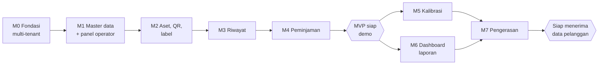

# 10 — Roadmap dan Urutan Pengerjaan

Estimasi disusun untuk **satu pengembang penuh waktu**. Dua pengembang mempersingkat
sekitar 35%, bukan setengahnya, karena sebagian pekerjaan berurutan.

---

## Ringkasan

### MVP — 6 minggu

Untuk **demo dan uji internal**. Data pelanggan sungguhan belum boleh masuk.

| Milestone | Isi | Estimasi |
|---|---|---|
| M0 | Fondasi multi-tenant | 1 minggu |
| M1 | Master data dan panel operator | 1 minggu |
| M2 | Aset, QR, dan label | 1,5 minggu |
| M3 | Riwayat dan lampiran | 1,5 minggu |
| M4 | Peminjaman | 1 minggu |
| | **Total MVP** | **6 minggu** |

### v1.1 — 3 minggu berikutnya

Wajib selesai **sebelum pelanggan pertama memasukkan data sungguhan**.

| Milestone | Isi | Estimasi |
|---|---|---|
| M5 | Pemeliharaan dan kalibrasi | 1 minggu |
| M6 | Dashboard, laporan, notifikasi, impor | 1 minggu |
| M7 | Pengerasan, 2FA, dan penyebaran | 1 minggu |

---

## Prinsip yang berlaku sepanjang pengerjaan

**Skema basis data dibangun lengkap di M0**, termasuk tabel untuk fitur v1.1 seperti
kalibrasi dan vendor. Menulis tabel yang belum dipakai itu murah; menambahkannya ke basis
data yang sudah berisi data pelanggan tidak.

**Isolasi tenant diuji sejak hari pertama.** Seed membuat dua organisasi contoh, bukan satu,
dan pengujian isolasi berjalan di CI sejak M0. Bug isolasi yang ditemukan di minggu pertama
adalah gangguan kecil; yang ditemukan setelah ada pelanggan adalah krisis.

**Jangan cetak label sungguhan sebelum domain produksi final.** Selama pengembangan,
`APP_URL` menunjuk `localhost` dan QR yang dihasilkan hanya berlaku di mesin sendiri.

---

## M0 — Fondasi Multi-tenant (1 minggu)

- Inisialisasi proyek Next.js, TypeScript, Tailwind, shadcn/ui
- **Skema Prisma lengkap** dan migrasi pertama: seluruh tabel, enum, dan indeks,
  termasuk yang baru dipakai di v1.1
- Row Level Security aktif pada seluruh tabel bertenant
- `db.ts` yang menetapkan `app.current_org` per transaksi, dan `db-platform.ts` terpisah
- Penegakan append-only di tingkat basis data: cabut hak `UPDATE`/`DELETE`, pasang rule
- Auth.js dengan kredensial, alur undangan dan atur ulang kata sandi
- Sesi 12 jam dengan pilihan "Ingat saya" 7 hari
- Matriks izin di `lib/permissions.ts` beserta pengujian unitnya
- Seed: satu `PLATFORM_OWNER`, **dua organisasi contoh** lengkap dengan datanya
- Docker Compose berjalan di lokal, termasuk MinIO untuk pengembangan
- **Pengujian isolasi tenant di CI**

**Selesai bila:** percobaan `UPDATE` pada `asset_events` gagal di tingkat basis data, dan
pengguna organisasi A tidak dapat membaca satu baris pun milik organisasi B.

---

## M1 — Master Data dan Panel Operator (1 minggu)

- CRUD lokasi berjenjang dengan pemeliharaan kolom `path`
- CRUD kategori dengan penanda alat medis dan interval kalibrasi bawaan
- Undangan pengguna, penetapan peran, penugasan cakupan lokasi
- **Panel operator**: daftar organisasi, buat organisasi baru, atur kuota dan status,
  masuk sebagai organisasi tertentu
- Penyalinan kategori bawaan saat organisasi baru dibuat
- Pemeriksaan kuota aset, penyimpanan, dan pengguna
- Pencatatan `platform.impersonate` di audit log organisasi
- Kerangka tata letak aplikasi dan navigasi

**Selesai bila:** sebuah organisasi pelanggan dapat dibuat dari panel operator sampai
undangan admin pertamanya terkirim, tanpa menyentuh basis data secara langsung.

---

## M2 — Aset, QR, dan Label (1,5 minggu)

- Formulir pendaftaran aset dengan validasi Zod
- Pembuat `public_id` dan `asset_code`
- Daftar aset dengan pencarian, filter, dan kursor pagination
- Halaman detail aset
- Pembuatan QR sebagai SVG
- Halaman cetak label tunggal dan lembar A4
- Pencatatan `label_prints`
- Halaman publik `/a/{publicId}` dengan pembatasan kolom dan identitas rumah sakit
- Pemindai kamera di dalam aplikasi

**Selesai bila:** sebuah aset dapat didaftarkan, labelnya dicetak, ditempel, dipindai
dengan ponsel sungguhan, dan halaman publiknya terbuka.

> Ini milestone yang paling perlu diuji di lapangan, bukan hanya di meja. Cetak sepuluh
> label percobaan dan pindai dengan ponsel yang sebenarnya akan dipakai petugas.

---

## M3 — Riwayat dan Lampiran (1,5 minggu)

- `event.service.ts` sebagai satu-satunya penulis riwayat
- `status-machine.ts` beserta pengujian seluruh transisi
- Formulir pencatatan riwayat per jenis
- Kompresi gambar di sisi klien
- Penerbitan presigned URL dan unggah langsung ke penyimpanan objek
- Pembaruan `used_storage_bytes` dan penolakan saat kuota terlampaui
- URL bertanda tangan untuk membaca lampiran
- Linimasa riwayat dengan penanda pencatatan mundur
- Alur koreksi
- Mutasi antar ruangan
- Penghapusan aset, halaman aset dihapuskan, dan pembatalan dalam 30 hari

**Selesai bila:** riwayat dapat dicatat lengkap dengan foto, tidak dapat diubah, koreksi
tampil berpasangan dengan entri aslinya, dan aset yang dihapuskan lalu dipulihkan kembali
ke status yang benar — bukan selalu ke `AVAILABLE`.

---

## M4 — Peminjaman (1 minggu)

- Formulir peminjaman untuk peminjam terdaftar dan peminjam luar
- Indeks parsial unik dan penanganan perlombaan penyimpanan
- Formulir pengembalian dengan penilaian kondisi
- Daftar peminjaman aktif dan yang melewati ambang
- Integrasi dengan status aset dan riwayat
- Perapian antarmuka dan pemeriksaan responsif pada lebar 360 px

**Selesai bila:** dua permintaan peminjaman bersamaan atas satu aset menghasilkan satu
peminjaman dan satu pesan galat yang jelas — dan **MVP siap didemokan**.

---

## M5 — Pemeliharaan dan Kalibrasi (1 minggu) · *v1.1*

- CRUD vendor
- Jadwal kalibrasi dan pemeliharaan preventif
- Pembuatan jadwal otomatis untuk aset berkategori medis
- Pencatatan pelaksanaan dengan hasil dan unggah sertifikat
- Penghitungan ulang jatuh tempo, termasuk dari masa berlaku sertifikat
- Perlakuan khusus untuk hasil tidak lulus
- Dashboard jatuh tempo

**Selesai bila:** mencatat kalibrasi memperbarui jadwal, dan hasil tidak lulus mengunci
alat dari pemakaian.

---

## M6 — Dashboard, Laporan, Notifikasi (1 minggu) · *v1.1*

- Dashboard per peran
- Ekspor Excel dan CSV untuk seluruh laporan yang didaftarkan di PRD
- Cetak riwayat aset
- pg-boss dan seluruh tugas terjadwal
- Templat email dan pengiriman ringkasan harian, dengan zona waktu per organisasi
- Impor massal dengan pratinjau validasi

**Selesai bila:** email ringkasan harian diterima berisi data yang benar pada jam yang
benar menurut zona waktu organisasinya, dan impor 100 aset dari Excel berhasil beserta
labelnya siap dicetak.

---

## M7 — Pengerasan dan Penyebaran (1 minggu) · *v1.1*

- Pembatasan laju di seluruh titik yang ditetapkan
- Header keamanan dan penyetelan CSP
- Autentikasi dua faktor opsional: pengaturan, kode pemulihan, daftar perangkat aktif
- Audit log lengkap
- Penanganan galat dan pesan berbahasa Indonesia untuk seluruh kode error
- Pengujian end-to-end untuk alur utama, termasuk isolasi tenant
- Penyiapan VPS, Caddy, bucket R2, cadangan, pemantauan
- Uji pemulihan cadangan
- Penyusunan panduan pengguna singkat dan materi pelatihan

**Selesai bila:** seluruh daftar periksa go-live di [09-deployment-ops.md](09-deployment-ops.md)
tercentang. **Baru setelah titik ini data pelanggan sungguhan boleh masuk.**

---

## Urutan Ketergantungan

M5 dan M6 dapat dikerjakan paralel bila ada dua pengembang.

---

## Rencana v2

Diurutkan menurut perkiraan nilai dibanding usahanya:

| Prioritas | Fitur | Alasan |
|---|---|---|
| 1 | Notifikasi WhatsApp | Email sering tidak dibaca staf klinis; WhatsApp jauh lebih efektif di lingkungan RS |
| 2 | Mode offline (PWA dengan antrean) | Bila pemakaian nyata membuktikan ada ruangan yang benar-benar menghambat pencatatan |
| 3 | Stok barang habis pakai | Permintaan yang hampir pasti muncul setelah aset berjalan |
| 4 | Pendaftaran mandiri dan penagihan otomatis | Ketika onboarding manual mulai memakan waktu, biasanya setelah pelanggan kelima |
| 5 | Work order pemeliharaan penuh | Bila tim teknik ingin mengelola antrean pekerjaan di sistem yang sama |
| 6 | Aset induk dan anak | Bila alat dengan banyak komponen terpisah terasa merepotkan dicatat satu-satu |
| 7 | Tanda tangan digital serah terima | Bila pertanggungjawaban peminjaman perlu diperkuat |
| 8 | Prosedur anonimisasi data peminjam | Bila permintaan penghapusan data pribadi benar-benar muncul |
| 9 | Integrasi SIMRS atau aplikasi aset daerah | Menunggu spesifikasi dari pihak terkait |
| 10 | Mewajibkan dua faktor untuk peran admin | 2FA sudah ada sebagai pilihan; ini soal mewajibkannya |

---

## Risiko terhadap Jadwal

| Risiko | Dampak | Penanganan |
|---|---|---|
| Bug isolasi tenant ditemukan terlambat | **Paling berat.** Kepercayaan pelanggan sulit dipulihkan | Seed dua organisasi dan pengujian isolasi di CI sejak M0, bukan di akhir |
| Domain belum final saat label pertama dicetak | Seluruh label harus dicetak ulang | `APP_URL` menunjuk localhost selama pengembangan; larangan cetak dicantumkan di dokumen dan di halaman cetak |
| Pemindaian kamera bermasalah pada perangkat tertentu | Alur utama terganggu | Uji pada perangkat sungguhan di M2, bukan menjelang rilis |
| Kalibrasi ditunda ke v1.1 | Demo terasa seperti aplikasi inventaris biasa | Sadari saat mendemokan: tekankan riwayat yang tidak bisa dihapus dan alur QR, sebutkan kalibrasi sebagai yang berikutnya |
| Lingkup melebar saat membangun panel operator | MVP mundur | Panel operator di M1 sengaja minimal: daftar, buat, kuota, masuk sebagai. Statistik dan grafik menunggu sampai ada pelanggan |
| MVP dipakai pelanggan sungguhan sebelum M7 | Data masuk ke sistem yang belum dikeraskan | Tahan sampai M7 selesai; ini bukan soal kehati-hatian berlebihan, melainkan cadangan dan audit yang belum teruji |