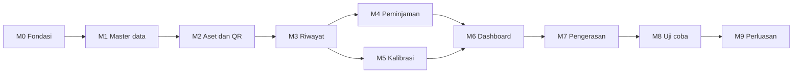

# 10 — Roadmap dan Urutan Pengerjaan

Estimasi disusun untuk **satu pengembang penuh waktu**. Dua pengembang mempersingkat
sekitar 35%, tidak setengahnya, karena sebagian pekerjaan berurutan.

---

## Ringkasan

| Milestone | Isi | Estimasi |
|---|---|---|
| M0 | Fondasi | 1 minggu |
| M1 | Master data dan pengguna | 1 minggu |
| M2 | Aset dan QR | 1,5 minggu |
| M3 | Riwayat dan lampiran | 1,5 minggu |
| M4 | Peminjaman | 1 minggu |
| M5 | Pemeliharaan dan kalibrasi | 1 minggu |
| M6 | Dashboard, laporan, notifikasi | 1 minggu |
| M7 | Pengerasan dan penyebaran | 1 minggu |
| | **Total sampai siap uji coba** | **9 minggu** |
| M8 | Uji coba satu instalasi | 4 minggu berjalan |
| M9 | Perbaikan dan perluasan | 2 minggu |

---

## M0 — Fondasi (1 minggu)

- Inisialisasi proyek Next.js, TypeScript, Tailwind, shadcn/ui
- Skema Prisma lengkap dan migrasi pertama, termasuk enum dan seluruh indeks
- Penegakan append-only di tingkat basis data: cabut hak, pasang rule
- Auth.js dengan kredensial, alur undangan dan atur ulang kata sandi
- Sesi 12 jam dengan pilihan "Ingat saya" 7 hari
- Matriks izin di `lib/permissions.ts` beserta pengujian unitnya
- Docker Compose berjalan di lokal
- Skrip seed

**Selesai bila:** dapat masuk sebagai Super Admin, dan percobaan `UPDATE` pada
`asset_events` gagal di tingkat basis data.

---

## M1 — Master Data dan Pengguna (1 minggu)

- CRUD lokasi berjenjang dengan pemeliharaan kolom `path`
- CRUD kategori dengan penanda alat medis dan interval kalibrasi bawaan
- CRUD vendor
- Undangan pengguna, penetapan peran, penugasan cakupan lokasi
- Kerangka tata letak aplikasi dan navigasi

**Selesai bila:** struktur lokasi satu instalasi dapat dibuat, dan pengguna `PIC_ROOM`
yang diundang hanya melihat cakupannya.

---

## M2 — Aset dan QR (1,5 minggu)

- Formulir pendaftaran aset dengan validasi Zod
- Pembuat `public_id` dan `asset_code`
- Daftar aset dengan pencarian, filter, dan kursor pagination
- Halaman detail aset
- Pembuatan QR sebagai SVG
- Halaman cetak label tunggal dan lembar A4
- Pencatatan `label_prints`
- Halaman publik `/a/{publicId}` dengan pembatasan kolom
- Pemindai kamera di dalam aplikasi

**Selesai bila:** sebuah aset dapat didaftarkan, labelnya dicetak, ditempel, dipindai
dengan ponsel sungguhan, dan halaman publiknya terbuka.

> Ini milestone yang paling perlu diuji di lapangan, bukan hanya di meja. Cetak sepuluh
> label sungguhan dan pindai di dalam gedung sebelum melanjutkan.

---

## M3 — Riwayat dan Lampiran (1,5 minggu)

- `event.service.ts` sebagai satu-satunya penulis riwayat
- `status-machine.ts` beserta pengujian seluruh transisi
- Formulir pencatatan riwayat per jenis
- Kompresi gambar di sisi klien
- Penerbitan presigned URL dan unggah langsung ke MinIO
- URL bertanda tangan untuk membaca lampiran
- Linimasa riwayat dengan penanda pencatatan mundur
- Alur koreksi
- Mutasi antar ruangan
- Penghapusan aset, halaman aset dihapuskan, dan pembatalan dalam 30 hari

**Selesai bila:** riwayat dapat dicatat lengkap dengan foto, tidak dapat diubah, koreksi
tampil berpasangan dengan entri aslinya, dan aset yang dihapuskan lalu dipulihkan kembali
ke status yang benar — bukan selalu ke `AVAILABLE`.

---

## M4 — Peminjaman (1 minggu)

- Formulir peminjaman untuk peminjam terdaftar dan peminjam luar
- Indeks parsial unik dan penanganan perlombaan penyimpanan
- Formulir pengembalian dengan penilaian kondisi
- Daftar peminjaman aktif dan yang melewati ambang
- Integrasi dengan status aset dan riwayat

**Selesai bila:** dua permintaan peminjaman bersamaan atas satu aset menghasilkan satu
peminjaman dan satu pesan galat yang jelas.

---

## M5 — Pemeliharaan dan Kalibrasi (1 minggu)

- Jadwal kalibrasi dan pemeliharaan preventif
- Pembuatan jadwal otomatis untuk aset berkategori medis
- Pencatatan pelaksanaan dengan hasil dan unggah sertifikat
- Penghitungan ulang jatuh tempo, termasuk dari masa berlaku sertifikat
- Perlakuan khusus untuk hasil tidak lulus
- Dashboard jatuh tempo

**Selesai bila:** mencatat kalibrasi memperbarui jadwal, dan hasil tidak lulus mengunci
alat dari pemakaian.

---

## M6 — Dashboard, Laporan, Notifikasi (1 minggu)

- Dashboard per peran
- Ekspor Excel dan CSV untuk seluruh laporan yang didaftarkan di PRD
- Cetak riwayat aset
- pg-boss dan seluruh tugas terjadwal
- Templat email dan pengiriman ringkasan harian
- Impor massal dengan pratinjau validasi

**Selesai bila:** email ringkasan harian benar-benar diterima berisi data yang benar,
dan impor 100 aset dari Excel berhasil beserta labelnya siap dicetak.

---

## M7 — Pengerasan dan Penyebaran (1 minggu)

- Pembatasan laju di seluruh titik yang ditetapkan
- Header keamanan dan penyetelan CSP
- Autentikasi dua faktor opsional: pengaturan, kode pemulihan, daftar perangkat aktif
- Audit log lengkap
- Penanganan galat dan pesan berbahasa Indonesia untuk seluruh kode error
- Pengujian end-to-end untuk alur utama
- Penyiapan VPS, Caddy, cadangan, pemantauan
- Uji pemulihan cadangan
- Pemeriksaan responsif pada lebar 360 px
- Penyusunan panduan pengguna singkat dan materi pelatihan

**Selesai bila:** seluruh daftar periksa go-live di [09-deployment-ops.md](09-deployment-ops.md) tercentang.

---

## M8 — Uji Coba Satu Instalasi (4 minggu berjalan)

Pilih satu instalasi, sebaiknya yang memiliki alat bernilai dan PIC yang kooperatif.

Minggu 1: pendataan seluruh aset instalasi, cetak dan tempel label, latih penggunanya.
Minggu 2–4: pemakaian harian sungguhan tanpa buku manual sebagai cadangan.

Yang diamati selama uji coba:

- Berapa peminjaman yang benar-benar tercatat dibanding yang terjadi
- Berapa lama rata-rata jeda antara kejadian dan pencatatannya
- Berapa label yang gagal dipindai dan mengapa
- Di ruangan mana sinyal tidak memadai
- Keluhan berulang dari pengguna

---

## M9 — Perbaikan dan Perluasan (2 minggu)

Perbaiki temuan uji coba, lalu perluas ke instalasi berikutnya. Perluasan sebaiknya
dilakukan satu instalasi pada satu waktu, bukan serentak.

---

## Urutan Ketergantungan

M4 dan M5 dapat dikerjakan paralel bila ada dua pengembang.

---

## Rencana v2

Diurutkan menurut perkiraan nilai dibanding usahanya:

| Prioritas | Fitur | Alasan |
|---|---|---|
| 1 | Notifikasi WhatsApp | Email sering tidak dibaca staf klinis; WhatsApp jauh lebih efektif di lingkungan RS |
| 2 | Mode offline (PWA dengan antrean) | Bila uji coba membuktikan ada ruangan yang benar-benar menghambat pencatatan |
| 3 | Stok barang habis pakai | Permintaan yang hampir pasti muncul setelah aset berjalan |
| 4 | Work order pemeliharaan penuh | Bila tim teknik ingin mengelola antrean pekerjaan di sistem yang sama |
| 5 | Aset induk dan anak | Bila alat dengan banyak komponen terpisah mulai terasa merepotkan dicatat satu-satu |
| 6 | Tanda tangan digital serah terima | Bila pertanggungjawaban peminjaman perlu diperkuat |
| 7 | Prosedur anonimisasi data peminjam | Bila permintaan penghapusan data pribadi benar-benar muncul |
| 8 | Integrasi SIMRS atau aplikasi aset daerah | Menunggu spesifikasi dari pihak terkait |
| 9 | Mewajibkan dua faktor untuk peran admin | 2FA sudah ada di v1 sebagai pilihan; ini soal mewajibkannya |
| 10 | Multi rumah sakit aktif | Bila sistem akan dipakai lebih dari satu unit |

---

## Risiko terhadap Jadwal

| Risiko | Dampak | Penanganan |
|---|---|---|
| Pendataan awal lebih lama dari perkiraan | Uji coba mundur | Impor massal disiapkan sejak M6; data dikumpulkan dengan templat Excel selama pengembangan berjalan |
| Pengadaan printer dan label tertunda | Label tidak dapat dicetak | Mulai dengan stiker vinyl A4 pada printer yang ada |
| Domain atau HTTPS belum siap | **Menghambat M2**, karena URL masuk ke QR yang dicetak | Amankan domain di awal M0, bukan menjelang penyebaran |
| Pemindaian kamera bermasalah pada perangkat tertentu | Alur utama terganggu | Uji pada perangkat sungguhan di M2, bukan di akhir |
| Pengguna tidak disiplin mencatat | Sistem tidak dipakai | Alur pencatatan dijaga tetap pendek; dukungan manajemen disiapkan sebelum uji coba |
